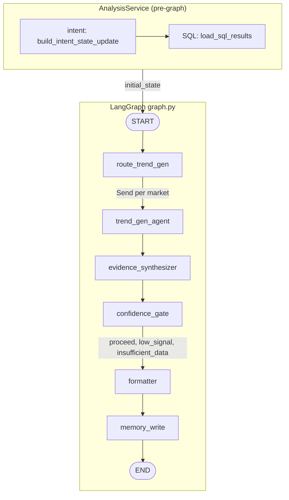

# Trend discovery graph workflow

This document describes the V2 analysis pipeline: **pre-graph bootstrap** in [`AnalysisService`](../services/analysis_service.py), the **LangGraph** compiled in [`graph.py`](graph.py), and where deterministic logic stops and LLM reasoning begins.

## Purpose

The system turns **market**, **category**, **recency window**, and optional **user query** into a structured trend report by combining:

- **Service layer (before `graph.stream`)** — deterministic SQLite reads via [`load_sql_results`](nodes/sql_dispatcher.py) (including prior-trend **memory** rows and `prior_snapshot`), plus optional LLM intent parsing via [`build_intent_state_update`](nodes/intent_parser.py)
- **LangGraph** — per-market `trend_gen_agent`, hybrid `evidence_synthesizer`, deterministic `formatter`, and `memory_write`
- **LLM telemetry** — each LLM call records duration, token usage, and estimated cost (when the gateway returns it) on `tool_invocations.metadata`; [`AnalysisService`](../services/analysis_service.py) aggregates these into `TrendReport.llm_ops` / `RunStatusResponse.stats.llm_ops`

---

## High-level flow

1. **`build_intent_state_update`** emits `QueryIntent` + `query_params` (and optional LLM `tool_invocations`).
2. **`load_sql_results`** loads `social` (from `post_trend_signals`), `search`, `sales`, and **`memory`** (prior `trend_exploration` rows), sets **`prior_snapshot`**, and returns `tool_invocations` for SQL slices.
3. **`graph.stream(initial_state, …)`** starts at **`START` → `route_trend_gen`** (not at an intent or SQL node inside the graph).
4. **`trend_gen_agent`** runs once per market (`Send`) and applies analytical lenses.
5. **`evidence_synthesizer`** scores, challenges, and stages candidates.
6. **`confidence_gate`** returns `proceed`, `low_signal`, or `insufficient_data` — **all three route to `formatter`** in `graph.py`.
7. **`formatter`** builds the API/UI report payload.
8. **`memory_write`** persists confirmed trends to `trend_exploration`.

---

## LLM usage

The graph uses `ChatOpenAI` via OpenRouter through [`llm.py`](llm.py). Structured outputs use `invoke_json_response_with_trace`, which fills `LlmTrace` with `duration_ms`, token counts, and `estimated_cost_usd` when the provider exposes them.

| Where | LLM usage |
|------|-----------|
| **AnalysisService** → `build_intent_state_update` | Optional structured parse of `user_query` into `QueryIntent` |
| **AnalysisService** → `load_sql_results` | None |
| **`trend_gen_agent`** | Structured output per active lens — [`LensCandidateBatch`](schemas.py) |
| **`evidence_synthesizer`** | Structured skeptical verdicts — [`SynthesizerVerdictBatch`](schemas.py) |
| **`formatter`** | Deterministic only |

The `messages` field still exists on state via `add_messages`, but this workflow does not use conversational memory or interruptions.

---

## Routing logic

### `route_trend_gen(state)`

Defined in [`graph.py`](graph.py). Entry from **`START`** (initial state already contains `query_intent` and `sql_results` from the service):

- Reads `state["query_intent"]["markets"]`
- Returns one `Send("trend_gen_agent", {..., "active_region": market})` per market

Cross-market runs fan out to multiple regions; single-market runs send one branch.

### `confidence_gate(state)`

Defined in [`graph.py`](graph.py). After `evidence_synthesizer`:

- If no synthesized trend has `status == "confirmed"` → `"insufficient_data"` → **`formatter`**
- If fewer than 3 confirmed trends, or `watch_list_only` → `"low_signal"` → **`formatter`**
- Otherwise → `"proceed"` → **`formatter`**

The synthesizer sets `watch_list_only` and `guardrail_flags` so the formatter can collapse output; there is no graph edge to `END` directly from the gate.

---

## State: `TrendDiscoveryState`

Shared state is a `TypedDict` in [`state.py`](state.py).

| Field | Role |
|------|------|
| `market`, `category`, `recency_days`, `analysis_mode`, `user_query` | Caller inputs from `AnalysisRunRequest` |
| `prior_snapshot` | Latest persisted trend snapshot (loaded in **`load_sql_results`**, before the graph) |
| `query_intent` | Structured intent from **`build_intent_state_update`** |
| `sql_results` | Canonicalized rows keyed by **`social`**, **`search`**, **`sales`**, **`memory`** |
| `active_region` | Injected by `Send` for each trend-generation branch |
| `trend_candidates` | Reducer `operator.add`; one list appended per market branch |
| `synthesized_trends` | Final ranked, challenged, lifecycle-tagged trend objects |
| `watch_list_only` | Flag set by synthesizer for low-signal reports |
| `formatted_report` | Partial during synthesis (`regional_divergences`), full after formatter |
| `guardrail_flags`, `execution_log`, `source_batch_ids`, `tool_invocations` | Reducer lists appended across nodes and pre-graph steps |
| `messages` | Present for future conversational graphs; unused in this workflow |

---

## Pre-graph bootstrap (`AnalysisService`)

### Intent — [`nodes/intent_parser.py`](nodes/intent_parser.py)

- `build_intent_state_update(state)` builds a deterministic default `QueryIntent` from UI fields.
- If `user_query` is present, calls the LLM via `invoke_json_response_with_trace(QueryIntent, …)`.
- Enforces supported markets (`HK`, `KR`, `TW`, `SG`) and known entity types; merges LLM output with UI constraints.

### SQL — [`nodes/sql_dispatcher.py`](nodes/sql_dispatcher.py)

- `load_sql_results(intent, …)` runs the full plan **`(social, search, sales, memory)`** via `select_query_plan`.
- **Social** path aggregates **`post_trend_signals`** (not raw `social_posts` in this hot path).
- **Memory** path loads prior `trend_exploration` rows via `get_prior_trend_snapshots` and sets `prior_snapshot`.
- Canonicalizes via `get_entity_dictionary()`; emits `sql_results`, `source_batch_ids`, and SQL `tool_invocations`.
- `run_sql_dispatcher(state)` wraps the same function for tests or tooling.

---

## LangGraph nodes (`graph.py`)

### `trend_gen_agent` — [`nodes/trend_gen.py`](nodes/trend_gen.py)

Per `active_region`:

- Resolves active lenses from [`determine_active_lenses(...)`](nodes/lenses.py)
- Builds a lens-specific data slice
- Calls `invoke_json_response_with_trace(LensCandidateBatch, …)` once per lens
- Merges duplicate terms across lenses while preserving `reasoning_blocks`

Writes `trend_candidates`, `execution_log`, branch-local metadata on `tool_invocations` (including LLM token/cost fields when returned).

### `evidence_synthesizer` — [`nodes/synthesizer.py`](nodes/synthesizer.py)

Deterministic scoring + LLM verdicts (see repo for formulas and post-verdict rules). Drops `noise`, may set `watch_list_only`, seeds `formatted_report.regional_divergences`.

### `formatter` — [`nodes/formatter.py`](nodes/formatter.py)

Builds the API report shape (trends, watch list, evidence, chips, lifecycle fields). If `watch_list_only`, items go to the watch list as implemented in code.

### `memory_write` — [`nodes/memory.py`](nodes/memory.py)

- Persists confirmed trends via [`persist_trend_report(...)`](../db/repository.py).
- `memory_read` is **not** a graph node; prior rows are loaded during **`load_sql_results`**.

---

## Lens set

Defined in [`nodes/lenses.py`](nodes/lenses.py):

| Lens | When active | Source slices |
|------|-------------|---------------|
| `Momentum` | Always | `social`, `search` |
| `Cross-Market Diffusion` | Cross-market runs only | `social`, `search`, `sales` |
| `Social-Sales Convergence` | Always | `social`, `sales` |
| `Emerging Ingredient` | When intent includes `ingredient` or `function` | `social`, `search` |
| `Brand Breakout` | When intent includes `brand` | `social`, `sales` |

---

## Parallelism

`route_trend_gen` uses LangGraph `Send`, so each market runs its own `trend_gen_agent` branch in parallel. Branches merge through the `trend_candidates` reducer before the synthesizer.

---

## Compilation and invocation

[`build_graph()`](graph.py) compiles with `MemorySaver()`. Checkpoints are keyed by `thread_id = run_id` from [`AnalysisService`](../services/analysis_service.py).

`MemorySaver` is process-local. Durable analytical memory comes from the SQLite **`trend_exploration`** table via **`load_sql_results` (read)** and **`memory_write` (write)**, not from LangGraph conversational memory.

---

## Tool invocations and trace limits

[`tools.py`](tools.py) `make_tool_invocation` truncates oversized prompt/response fields (see `TRACE_FIELD_LIMIT`) and records truncation in `metadata`, keeping run JSON bounded while preserving observability.

---

## Edge summary

| From | To | Mechanism |
|------|----|-----------|
| `START` | `route_trend_gen` | Conditional from `START` |
| `route_trend_gen` | `trend_gen_agent` | `Send` per market |
| `trend_gen_agent` | `evidence_synthesizer` | Fixed edge after branch merge |
| `evidence_synthesizer` | `formatter` | `confidence_gate` → always `formatter` |
| `formatter` | `memory_write` | Fixed edge |
| `memory_write` | `END` | Fixed edge |

This matches the graph defined in [`graph.py`](graph.py).
