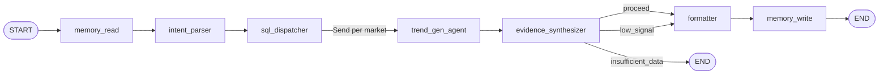

# Trend discovery graph workflow

This document describes the V2 LangGraph workflow in [`graph.py`](graph.py): node responsibilities, conditional routing, state, and where deterministic logic stops and LLM reasoning begins.

## Purpose

The graph turns **market**, **category**, **recency window**, and optional **user query** into a structured trend report. The system now combines:

- deterministic memory reads and SQLite retrieval
- deterministic score computation and lifecycle rules
- LLM-based intent parsing, multi-lens trend generation, and adversarial verification

The graph is built and invoked from [`AnalysisService`](../services/analysis_service.py), which passes `thread_id = run_id` for checkpointing and streams `execution_log` updates.

---

## High-level flow

1. **`memory_read`** loads the latest prior snapshot for lifecycle comparison.
2. **`intent_parser`** emits a structured `QueryIntent`.
3. **`sql_dispatcher`** performs all repository reads and canonicalization.
4. **`trend_gen_agent`** runs once per market and applies multiple analytical lenses.
5. **`evidence_synthesizer`** scores, challenges, and stages candidates.
6. **`confidence_gate`** chooses `proceed`, `low_signal`, or `insufficient_data`.
7. **`formatter`** builds the API/UI report.
8. **`memory_write`** persists finalized trend snapshots to `trend_exploration`.

---

## LLM usage

The graph now uses `ChatOpenAI` via OpenRouter through [`llm.py`](llm.py).

| Node | LLM usage |
|------|-----------|
| `intent_parser` | Optional structured parse of free-form `user_query` into `QueryIntent` |
| `sql_dispatcher` | None; deterministic only |
| `trend_gen_agent` | Structured output per active lens using [`LensCandidateBatch`](schemas.py) |
| `evidence_synthesizer` | Structured skeptical verdicts using [`SynthesizerVerdictBatch`](schemas.py) |
| `formatter` | Deterministic narrative formatting today |

The `messages` field still exists on state via `add_messages`, but the V2 graph does not use conversational memory or interruptions.

---

## Routing logic

### `route_trend_gen(state)`

Defined in [`graph.py`](graph.py). After `sql_dispatcher`:

- Reads `state["query_intent"]["markets"]`
- Returns one `Send("trend_gen_agent", {..., "active_region": market})` per market

This means a cross-market run fans out to `HK`, `KR`, `TW`, and `SG`; a single-market run sends exactly one branch.

### `confidence_gate(state)`

Defined in [`graph.py`](graph.py). After `evidence_synthesizer`:

- If no synthesized trend has `status == "confirmed"` → `"insufficient_data"` → `END`
- If fewer than 3 confirmed trends, or the synthesizer set `watch_list_only` → `"low_signal"` → `formatter`
- Otherwise → `"proceed"` → `formatter`

The `low_signal` branch still formats a report, but collapses confirmed items into the watch list.

---

## State: `TrendDiscoveryState`

Shared state is a `TypedDict` in [`state.py`](state.py).

| Field | Role |
|------|------|
| `market`, `category`, `recency_days`, `analysis_mode`, `user_query` | Caller inputs from `AnalysisRunRequest` |
| `prior_snapshot` | Latest persisted trend snapshot keyed as `"{market}:{term}"` |
| `query_intent` | Structured intent from `intent_parser` |
| `sql_results` | Canonicalized deterministic source rows keyed by `social`, `search`, `sales` |
| `active_region` | Injected by `Send` for each trend-generation branch |
| `trend_candidates` | Reducer `operator.add`; one list appended per market branch |
| `synthesized_trends` | Final ranked, challenged, lifecycle-tagged trend objects |
| `watch_list_only` | Flag set by synthesizer for low-signal reports |
| `formatted_report` | Partial during synthesis (`regional_divergences`), full after formatter |
| `guardrail_flags`, `execution_log`, `source_batch_ids` | Reducer lists appended across nodes |
| `messages` | Present for future conversational graphs; unused in V2 |

---

## Node-by-node behavior

### 1. `memory_read`

**File:** [`nodes/memory.py`](nodes/memory.py)

- Calls [`get_prior_trend_snapshot(...)`](../db/repository.py)
- Reads the most recent trend rows for the current `market` and `category`
- Writes `prior_snapshot` and an execution-log line

### 2. `intent_parser`

**File:** [`nodes/intent_parser.py`](nodes/intent_parser.py)

- Builds a deterministic default `QueryIntent` from UI request fields
- If `user_query` is present, calls `ChatOpenAI.with_structured_output(QueryIntent)`
- Enforces supported markets (`HK`, `KR`, `TW`, `SG`) and known entity types
- Writes `query_intent` and execution-log entries

This node is the only place where free-form user text is interpreted.

### 3. `sql_dispatcher`

**File:** [`nodes/sql_dispatcher.py`](nodes/sql_dispatcher.py)

- Selects a deterministic query plan from `analysis_mode`, `entity_types`, and `focus_hint`
- Calls repository helpers:
  - [`get_social_trend_rows(...)`](../db/repository.py)
  - [`get_search_breakout_rows(...)`](../db/repository.py)
  - [`get_sales_velocity_rows(...)`](../db/repository.py)
- Canonicalizes aliases via [`get_entity_dictionary()`](../db/repository.py)
- Emits `sql_results = { "social": [...], "search": [...], "sales": [...] }`
- Emits consolidated `source_batch_ids`

This is the graph’s only raw data access layer.

### 4. `trend_gen_agent`

**File:** [`nodes/trend_gen.py`](nodes/trend_gen.py)

Per `active_region`, the node:

- Resolves active lenses from [`determine_active_lenses(...)`](nodes/lenses.py)
- Builds a lens-specific data slice
- Calls `ChatOpenAI.with_structured_output(LensCandidateBatch)` once per lens
- Requires each candidate to return:
  - `trend_statement` — ONE sentence abstracting the signal into a general consumer/category trend (never a product or single brand)
  - `data_pattern`
  - `viral_reasoning`
  - `strongest_signal`
  - `weakest_signal`
  - `self_confidence`
- Merges duplicate terms across lenses while preserving `reasoning_blocks` and carrying `trend_statement` from the highest-confidence lens

The node writes `trend_candidates`, `execution_log`, and branch-local `source_batch_ids`.

### 5. `evidence_synthesizer`

**File:** [`nodes/synthesizer.py`](nodes/synthesizer.py)

This node combines deterministic scoring with adversarial review.

Deterministic steps:

- Normalize `avg_engagement`, `search_wow_delta`, and `sales_velocity`
- Compute:

`virality_score = 0.35 * social + 0.30 * sales + 0.25 * search + 0.10 * cross_market`

- Assign `confidence_tier`
- Detect regional divergence from provisional market-level scores
- Derive `lifecycle_stage` using the prior snapshot

LLM step:

- Calls `ChatOpenAI.with_structured_output(SynthesizerVerdictBatch)`
- Returns one verdict per canonical term:
  - `confirmed`
  - `watch`
  - `noise`
- May optionally sharpen `trend_statement` (must stay a one-sentence general trend, never a product)
- Adds `challenge_notes`, `hype_only`, and `seasonal_risk`

Final behavior:

- Drops `noise`
- Downgrades low-confidence or hype-only items to `watch`
- Sets `watch_list_only` for low-signal runs
- Seeds `formatted_report = { "regional_divergences": [...] }`

### 6. `formatter`

**File:** [`nodes/formatter.py`](nodes/formatter.py)

Builds the API report shape:

- `trend_statement` (one-sentence abstracted general trend)
- `headline` (defaults to `trend_statement` when present, otherwise falls back to a term-based sentence)
- `why_viral`
- evidence strings for social, search, sales, and cross-market coverage
- `signal_chips`
- `trend_stage`
- `lens`
- `lifecycle_stage`
- `self_confidence`
- `challenge_notes`

If `watch_list_only` is true, all items are emitted to `watch_list`.

### 7. `memory_write`

**File:** [`nodes/memory.py`](nodes/memory.py)

- Persists finalized report rows through [`persist_trend_report(...)`](../db/repository.py)
- Writes one row per trend/watch-list item to `trend_exploration`
- Stores `report_json` on each persisted snapshot row

---

## Lens set

Defined in [`nodes/lenses.py`](nodes/lenses.py):

| Lens | When active | Source slices |
|------|-------------|---------------|
| `Momentum` | Always | `social`, `search` |
| `Cross-Market Diffusion` | Cross-market runs only | `social`, `search`, `sales` |
| `Social-Sales Convergence` | Always | `social`, `sales` |
| `Emerging Ingredient` | When intent includes `ingredient` or `function` | `social`, `search` |
| `Brand Breakout` | When intent includes `brand` | `social`, `sales` |

---

## Parallelism

`route_trend_gen` uses LangGraph `Send`, so each market runs its own `trend_gen_agent` branch in parallel. Those branches merge through the `trend_candidates` reducer before entering the synthesizer.

---

## Compilation and invocation

[`build_graph()`](graph.py) compiles with `MemorySaver()`. Checkpoints are keyed by `thread_id = run_id` from [`AnalysisService`](../services/analysis_service.py).

`MemorySaver` is process-local. Durable analytical memory comes from the SQLite `trend_exploration` table via `memory_read` and `memory_write`, not from LangGraph checkpoints.

---

## Edge summary

| From | To | Mechanism |
|------|----|-----------|
| `START` | `memory_read` | Fixed edge |
| `memory_read` | `intent_parser` | Fixed edge |
| `intent_parser` | `sql_dispatcher` | Fixed edge |
| `sql_dispatcher` | `trend_gen_agent` | `route_trend_gen` → list of `Send` |
| `trend_gen_agent` | `evidence_synthesizer` | Fixed edge after branch merge |
| `evidence_synthesizer` | `formatter` or `END` | `confidence_gate` |
| `formatter` | `memory_write` | Fixed edge |
| `memory_write` | `END` | Fixed edge |

This matches the graph defined in [`graph.py`](graph.py).
